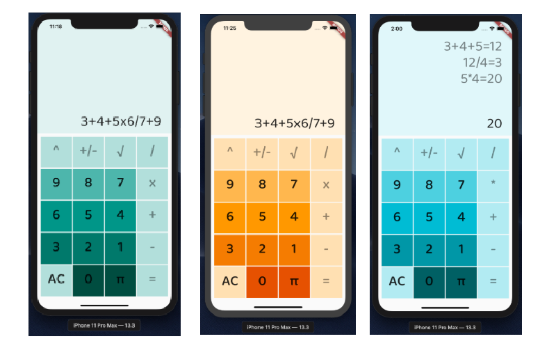

## Calculator 
This calculator was built as an exercise to get to know Flutter's UI components better. As I was making it, I also wanted to practice forming a grammar for a recursive descent parser and experimented with trying to calculate value via the parser rather than working with an absract syntax tree. 

## Interface 
-----

## Potential Improvements 
----
Things that I would refactor or improve upon if I was doing this all from scratch (or modifying them here):
* Build using Colors on its own instead of MaterialColors to avoid clashes when passing around color values
* Manipulate the ListView so the scroll goes down instead of up and shows latest entry rather than staying at the top 
* Build out the recursive descent parser further
* Use List.generate to populate the GridView instead of using generateCalcButton so many times in CalculatorFormatting 
* Modify the build function in CalculatorLanding to be more streamlined. Define a function to generate the Column/Widget/Expanded trio. 

## Grammar
----- 

*program &rarr; stmtList =* \
*stmt_list &rarr; stmt stmtList* \
*stmt &rarr; -(expr) | expr* \
*expr &rarr; term termTail* \
*termTail &rarr; addOp term termTail* \
*factorTail &rarr; multOp factor factorTail* \ 
*factor &rarr; √(expr) | (expr) | ^(expr)(expr) | number*  
*addOp &rarr; +|-* \
*multOp &rarr; \*|/*
